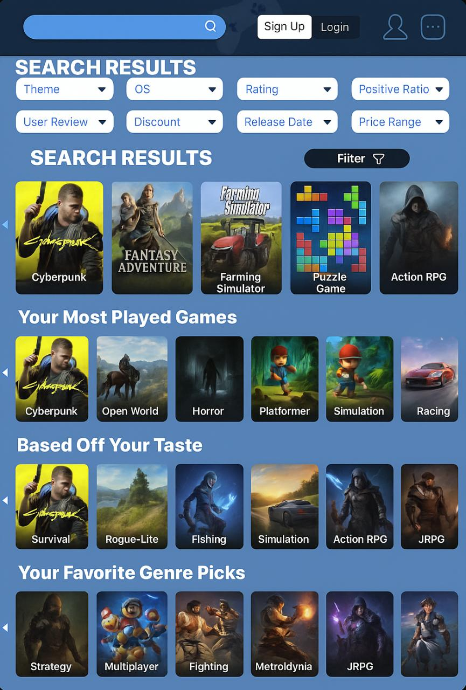
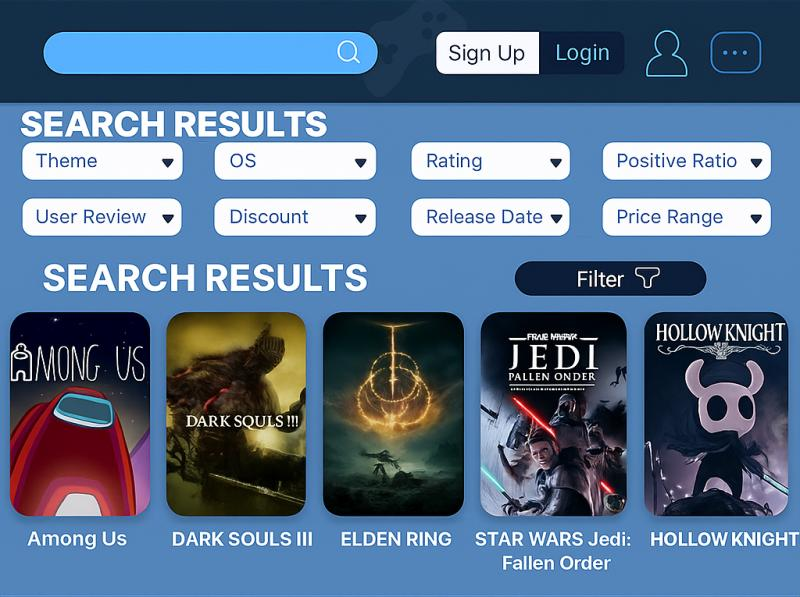
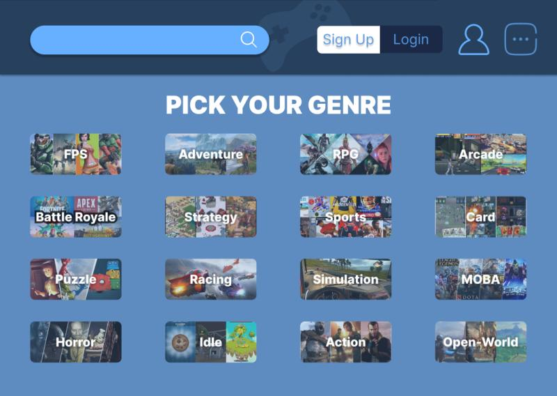

🎮 AI-Driven Game Recommendation System
This project is an AI-driven game recommendation system developed for the McHacks hackathon. The system leverages Steam's Web API to dynamically fetch user gameplay data and applies personalization algorithms to deliver tailored game suggestions based on user preferences and interaction history.

✨ Key Features
Dynamic Data Integration: Utilizes the Steam Web API to retrieve real-time user gameplay information.

Personalized Recommendations: Employs machine learning models to generate game suggestions uniquely tailored to each user.

Intuitive User Interface: A simple web interface, built with Flask, to present recommendations in a clear and organized manner.

💻 Technologies & Tools
Python: The core programming language for the project.

Pandas & Numpy: Used for efficient data manipulation and numerical operations.

Scikit-learn: For implementing the underlying machine learning models and algorithms.

Flask: The web framework used to build the application's front-end.

Steam Web API: The primary source for user gameplay data.

📸 Project Demonstration
Here are some screenshots demonstrating the system in action. The images are located in the demo_images/ directory.

 

